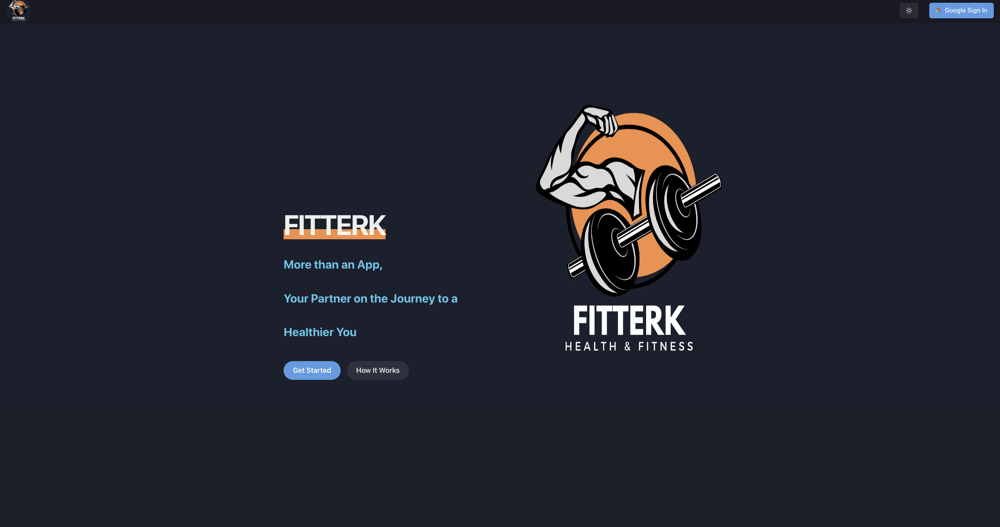

# Fitterk Workout App

## Overview

Fitterk is a fitness app designed for resistance training. It allows users to create, track, and update their daily workout routines. The app provides a user-friendly interface to select exercises based on specific body parts, add sets and repetitions, and track progress over time.

## Features

- **User Authentication:** Sign in with Google or Facebook to create a profile and start tracking your workouts.

- **Exercise Selection:** Choose exercises based on specific body parts to tailor your workout routine.

- **Set and Rep Tracking:** Add sets, repetitions, and weight for each exercise to monitor your performance.

- **Physical Stats Tracking:** Track your physical stats like weight, height, and daily calorific intake to monitor overall fitness progress.

- **Workout History:** Users can go back and view, add, update, or delete past workouts to maintain a comprehensive workout history.

## Technologies Used

- **Next.js:** A React framework for building server-rendered and statically generated web applications.

- **Firebase Firestore:** A NoSQL cloud database to store and manage workout data.

- **Firebase Authentication:** Provides user authentication services for secure login and profile management.

- **Chakra UI:** A popular React UI framework for designing responsive and accessible user interfaces.

- **Immer:** A library for working with immutable data structures to simplify state management.

## Getting Started

### Running the Project Locally

1. Install dependencies: Run `npm install` in the root project directory.

2. Run the project: Execute `npm run dev` to start the development server.

### Project Structure

- **Components:** React components used throughout the app.

- **Firebase:** Configuration and utility functions for Firebase integration.

- **Context:** React context for managing user authentication.

- **Styles:** Stylesheets and theme configuration for Chakra UI.

- **ExerciseList:** A list of exercises categorized by body parts.

## Usage

1. Sign-in using Google Account 

2. Click on "Start a Workout" to begin creating your workout routine.

3. Follow the step-by-step process to select the body part, choose an exercise, add sets and reps, and review your exercises.

4. Finish the workout by clicking "Finish Workout." The app will store your workout data in Firebase Firestore.

5. View and manage your workout history by navigating to past workouts.

## Contributing

Contributions to the Fitterk Workout App are welcome! If you find any bugs or have suggestions for improvements, feel free to submit an issue or pull request.

## Acknowledgments

- Special thanks to the [Chakra UI](https://chakra-ui.com/) and [Firebase](https://firebase.google.com/) communities for their excellent tools and documentation.

Enjoy your workouts with Fitterk!
